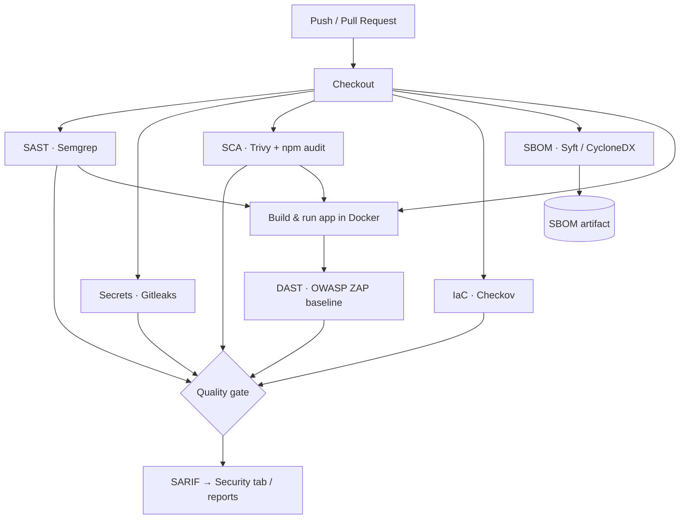

# Pipeline architecture

The same control set runs on GitHub Actions and GitLab CI. Static controls (SAST,
secrets, SCA, IaC, SBOM) run in parallel off the checkout; DAST runs after the
static gates because it needs the app built and running.

## Data flow

1. **Checkout** the code.
2. **Static controls** run in parallel and emit **SARIF** (or native reports).
3. **SBOM** is generated from the app's dependency graph and stored as an artifact.
4. The app is **built and run in Docker**; **DAST** exercises it over HTTP.
5. Results land in the platform's security surface (GitHub **Security** tab /
   GitLab **Security Dashboard**); the **quality gate** decides pass/fail based on
   the thresholds in [`../policies/`](../policies/).

## Design notes

- **Parallel static stages** keep feedback fast; DAST is gated behind SAST/SCA so
  a broken build doesn't waste time spinning up the app.
- **SARIF everywhere** gives one normalized findings format across tools.
- **Report-mode by default** (see `policies/README.md`) — promote controls to
  blocking as confidence in their signal grows.
